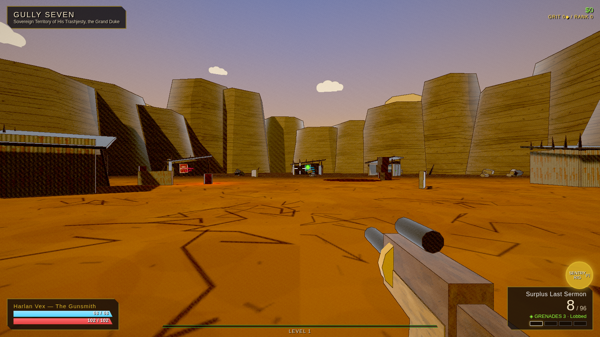
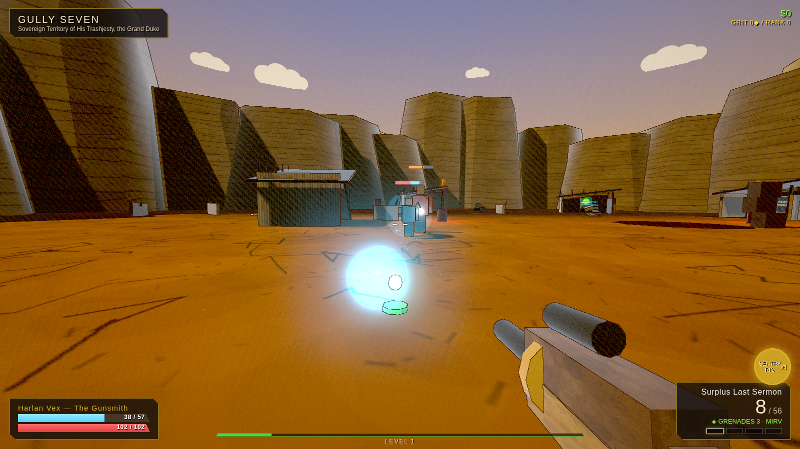
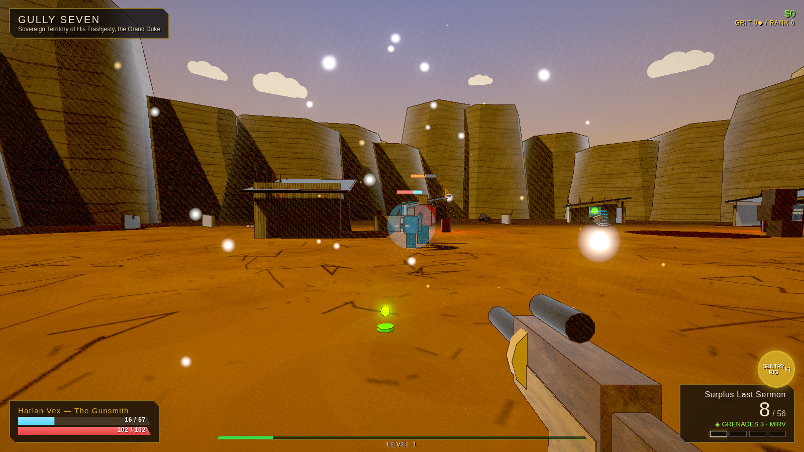
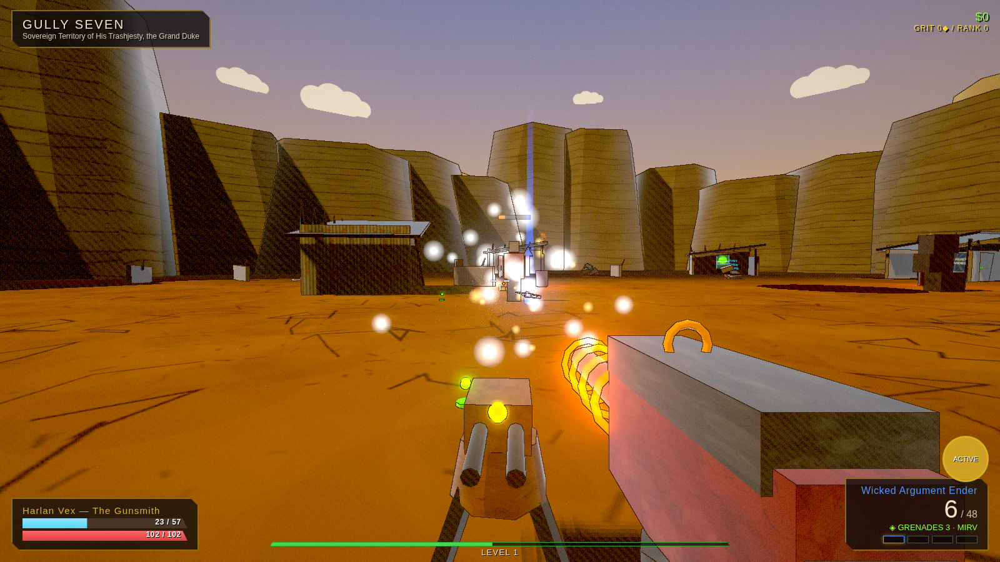
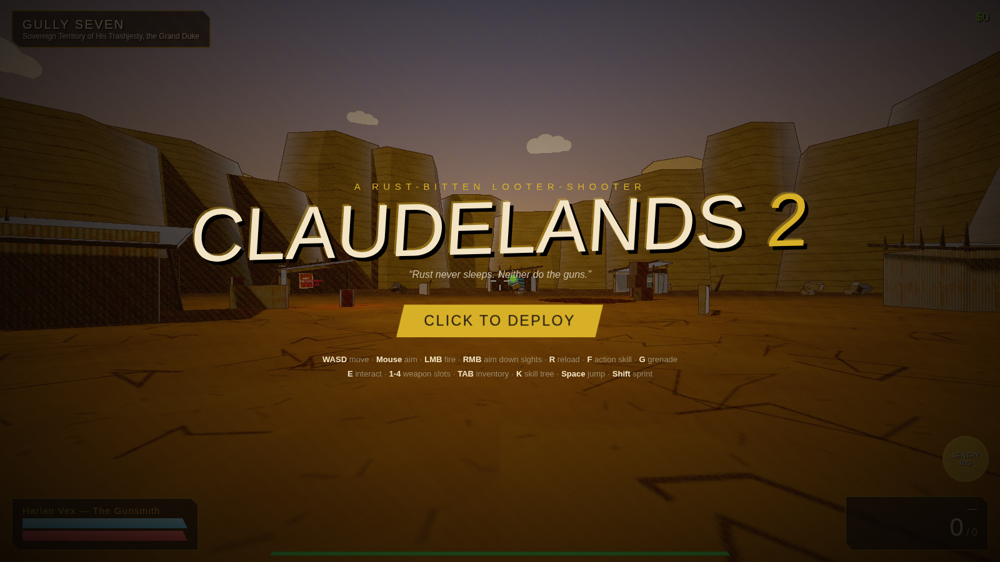

# CLAUDELANDS 2

*A rust-bitten, cel-shaded looter-shooter vertical slice.* You are **Harlan Vex,
the Gunsmith**, contracted to de-throne Grand Duke Gutterball, self-crowned king
of Gully Seven. Kill the Rustborn, ride the loot fountain, feed the Sentry Rig.

Everything is procedural — meshes, textures, audio — and everything that is
*content* (guns, parts, manufacturers, elements, skills, enemies, zones, jokes)
is data. See `DECISIONS.md` for the why and `ROADMAP.md` for what's next.



| | |
| --- | --- |
|  |  |
|  |  |
|  |  |

## Run it

```bash
npm install
npm run dev        # http://localhost:5173
```

- `npm run build` — typecheck + production build to `dist/`
- `npm run preview` — serve the production build
- Open `/sandbox.html` (dev or preview) for the **art sandbox**: manufacturer
  gun lineup on a turntable + live sliders for ink/hatch/rim/bloom/saturation.
- `npm run screenshot` — headless self-review: boots the game, plays the loop
  via the `window.__game` debug seam, and drops identity screenshots in `shots/`.

## Controls

| Input | Action |
| --- | --- |
| WASD / Space / Shift | Move / jump / sprint |
| Mouse / LMB / RMB | Aim / fire / aim-down-sights |
| R | Reload (BRISKCO guns: throws the gun. It explodes.) |
| F | Action skill — deploy the Sentry Rig |
| G | Grenade (delivery + element from equipped mod) |
| E | Interact — pick up loot, open chests, vendors, wire spools |
| 1–4 | Weapon slots |
| TAB | Backpack / equipment |
| K | Skill trees + Grit Rank |

## The pitch, mechanically

- **Part-based gun generation**: body fixes one of six manufacturers (each with a
  gimmick, a silhouette, a palette, and a reload personality); barrel/grip/stock/
  sight/mag/accessory each carry stat mods *and* geometry. Rarity gates part
  grades and the accessory slot; legendaries stamp a signature effect and red text.
- **Five elements** (Ember/Bile/Volt/Rime/Blast) with a strong/weak matrix vs
  shield/armor/flesh, DoTs, chains, slows, and splash.
- **One full class**: action skill + three 6-tier trees (passives, kill skills,
  rig augments, capstones), plus account-wide **Grit Rank** meta-perks.
- **Fight For Your Life**: get a kill while downed for a second wind.
